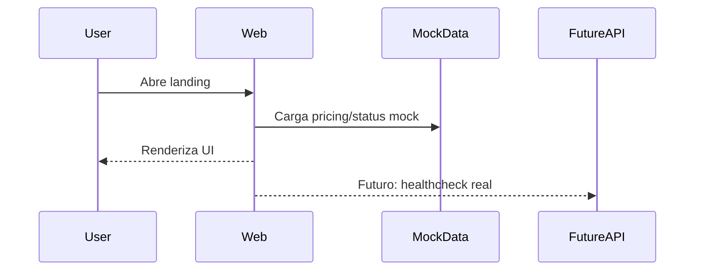

# Flujo de datos

Estado del documento: Vigente  
Ultima actualizacion: 2026-05-10

## Actual

- Pricing local en `src/data/pricing.js`.
- Features/sections en `src/data/features.js`.
- FAQ en `src/data/faq.js`.
- Site health mock en `src/data/siteHealth.js`.
- Status metrics mock en `src/data/statusMetrics.js`.
- No existe backend conectado.

## Futuro

Endpoints candidatos:

- `/api/health`
- `/api/market-data`
- `/api/ai-analysis`
- `/api/billing`
- `/api/users`
- `/api/journal`

## Riesgos

- Los mocks deben estar claramente marcados para no confundirse con telemetria real.
- La integracion futura debe manejar loading, error, retries y seguridad.
